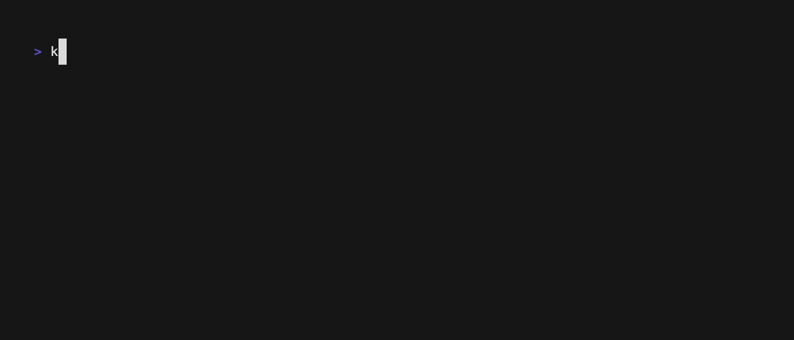

# Duplik8s

---

**Duplicate** 🔁 kubectl plugin to duplicate resources in a Kubernetes cluster.

<p>
    <a href="https://github.com/Telemaco019/duplik8s/actions"></a>
</p>

---



**duplik8s** allows you to easily duplicate Kubernetes Pods with overridden commands and configurations. This is useful
for testing, debugging, and development purposes.

Think of **duplik8s** as
[kubectl debug --copy-to](https://kubernetes.io/docs/tasks/debug/debug-application/debug-running-pod/#copying-a-pod-while-changing-its-command)
on steroids:

* **Support multiple resources**: Duplicate not just Pods, but also `Deployments` and `StatefulSets`.
* **Easy Tracking**: All duplicated resources are tagged with a duplik8s label for easy identification and cleanup.
* **Persistent Storage Handling**: Smoothly duplicate Pods mounting persistent volumes without issues.
* **Probes cleanup**: Disable liveness and readiness probes to keep the cloned Pod idle and avoid restarts.
* **User-Friendly Syntax**: straightforward syntax that simplifies the selection and duplication of resources.

## Installation

### Install with Homebrew (Mac/Linux)

```sh
$ brew tap Telemaco019/duplik8s
$ brew install duplik8s
```

### Install with Go

```sh
$ go install github.com/telemaco019/duplik8s/kubectl-duplicate@latest
```

### Use as k9s plugin

As you might have guessed, **duplik8s** shines when used in combination with the
amazing [k9s](https://github.com/derailed/k9s) ✨.

After installing `duplik8s`, you can add it to your k9s plugins by adding the following to
your `$XDG_CONFIG_HOME/k9s/plugins.yml` file.

After reloading k9s, you should be able to duplicate Pods with `Ctrl-T`.

```yaml
# $XDG_CONFIG_HOME/k9s/plugins.yaml
plugins:
  duplik8s-pod:
    shortCut: Ctrl-T
    description: Duplicate Pod
    scopes:
      - po
    command: kubectl
    background: true
    args:
      - duplicate
      - pod
      - $NAME
      - -n
      - $NAMESPACE
      - --context
      - $CONTEXT
  duplik8s-deploy:
    shortCut: Ctrl-T
    description: Duplicate Deployment
    scopes:
      - deploy
    command: kubectl
    background: true
    args:
      - duplicate
      - deploy
      - $NAME
      - -n
      - $NAMESPACE
      - --context
      - $CONTEXT

```

On MacOS, you can find the `plugins.yml` file at `~/Library/Application Support/k9s/plugins.yaml`.

For more information on k9s plugins, you can refer to the [official documentation](https://k9scli.io/topics/plugins).

## Examples

**duplik8s** supports all the standard flags available in `kubectl`, such as `--namespace`, `--context`,
and `--kubeconfig`. You can get the full list of flags by running `kubectl duplicate --help`.

### Duplicate a Pod

```sh
$ kubectl duplicate pod my-pod
```

The cloned Pod will be identical to the original, but with probes disabled and commands overridden to keep it idle.

### Interactively select a Pod to duplicate

```sh
$ kubectl duplicate pod  
```

The command will prompt you to select a Pod from the list of available Pods in the specified namespace.

### Duplicate a Deployment

```sh
$ kubectl duplicate deployment my-deployment
```

### Run a specific command in a cloned Pod

```sh
$ kubectl duplicate pod nginx-pod --command-override "/bin/sh","-c","echo Hello, World"
```

With this, you can easily duplicate a Pod and run any command you want in the new instance.

## Use cases

**Scenario 1**: You've got a Pod running, but it's not behaving as expected.
You need to dive in and debug the issue, maybe install some extra tools along the way.

**Scenario 2**: You need to run some scripts or commands in the exact same environment as a running Pod,
including all the environment variables, secrets, and configurations.

In these cases, you don't want to risk messing with the live Pod.
Instead, just use `duplik8s`! It duplicates the Pod with the same specs but keeps it idle so you can open a shell
and troubleshoot without any disruptions. 🎉

Skip the hassle of manually copying configurations, changing commands, and tweaking probes.
With `duplik8s`, simply run `kubectl duplicate pod my-pod` and you're done! Want to customize? Just add flags. Easy
peasy! ⚡

Even better, if you're using `duplik8s` with `k9s`, just press `Ctrl-T` to duplicate the Pod and s to open a shell
in one of its containers. 🚀

--- 

## License

This project is licensed under the Apache License. See the [LICENSE](./LICENSE) file for details.

